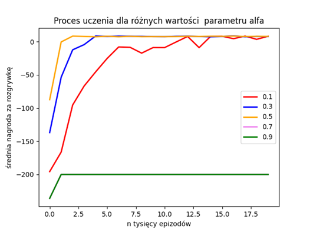
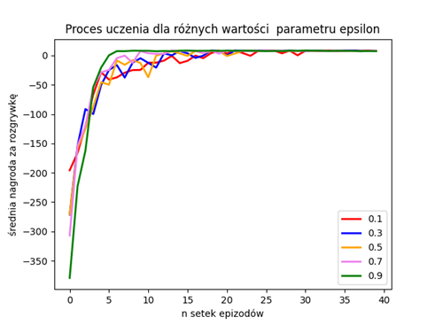
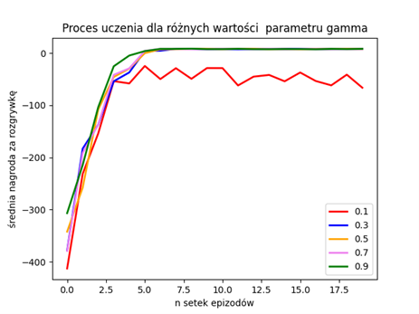

# Uczenie ze wzmocnieniem 
## 1) Wstęp
Repozytorium zawiera implementację algorytmu o nazwie „Q-learning” oraz przetestowanie działania programu dla problemu „Taxi”, w którym taksówka ma za zadanie odebrać klienta z zadanej lokalizacji, a następnie dostarczyć go w odpowiednie miejsce jak najmniejszym kosztem. 
W trakcie realizacji zadania wykorzystano definicje środowiska z narzędzia [gym](https://www.gymlibrary.dev/) udostępnionej przez [OpenAI](https://github.com/openai/). \
&nbsp;
\
Taksówka poruszająca się po planszy ma w każdym kroku możliwość wyboru 6 różnych akcji, cztery odpowiadają przemieszczeniu się w jednym z kierunków świata, dwa kolejne to odebranie lub zostawienie pasażera. Każdy krok wiąże się z kosztem równym -1 punkt, każda błędna akcja (na przykład zostawienie pasażera w złym miejscu) wiąże się z karą -10 punktów. Sukces jest nagradzany 20 punktami.

Taksówka jest w tym zadaniu „agentem”, który w procesie uczenia zdobywa wiedzę na temat środowiska w którym operuje. Jego wiedza reprezentowana jest w postaci macierzy, w której każdy wiersz odpowiada konkretnemu stanowi gry, a każda kolumna – akcji którą może w danym stanie podjąć agent. 
Początkowo macierz wypełniona jest zerami co reprezentuje brak wiedzy agenta o środowisku, przed rozpoczęciem procesu uczenia. 

W każdym kolejnym kroku „agent” aktualizuje swoją wiedzę zgodnie ze wzorem:

Q(stan,akcja)=(1- α)∙Q(stan,akcja)+ α∙(Nagroda+ γ*max⁡(Q(kolejnystan,… )- Q(stan,akcja))

Współczynnik α, odpowiada za tępo uczenia, definiuje jak bardzo zmieni się wartość Q w każdym kroku. Parametr γ  decyduje o tym, jak mocny jest wpływ najlepszej możliwości wyboru przyszłej akcji na wprowadzaną poprawkę.
O wyborze kolejnej akcji, decyduje parametr ε. Określa on prawdopodobieństwo, że agent zdecyduje się w danym kroku na eksplorację zamiast na eksploatacje środowiska.

## 2) Decyzje projektowe
Właściwa implementacja właściwa składa się z dwóch plików:
* 	„agent.py” – zawiera klasę Agent, która reprezentuje badający środowisko podmiot. Atrybuty agenta, to: początkowa tabela wiedzy o środowisku, parametr alfa, gamma oraz epsilon. Jego główne metody związane są z wykonywaniem akcji w środowisku („act”), wyciąganiem wniosków zgodnie ze wzorem podanym w pierwszym rozdziale („learn”) oraz rozwiązywaniem zadania po procesie uczenia („solve”)
* 	„q-learning.py” – implementacja algorytmu q-learning, zrealizowana w pojedynczej funkcji. Funkcja przyjmuje na wejściu klasy reprezentujące agenta i środowisko, oraz liczbę epizodów, przez którą odbywać się uczenie agenta. Funkcja następnie zwraca już wyuczonego agenta z wypełnioną macierzą wiedzy.

## 3) Przykładowe wyniki
Poniżej przedstawiono wyniki strojenia metody poprzez sprawdzanie wpływu zmiany wartości poszczególnych parametrów na wyniki metody.
Ustalone wartości parametrów to: ε = 0,7 natomiast γ= 0,5.
Poniżej przedstawiono badanie wpływu wartości parametru α.

Na podstawie tego wykresu wybrano wartość α = 0,5. 
W kolejnym eksperymencie badano wpływ parametru ε.

Na podstawie wykresy z rysunku 2 wybrano wartość parametru ε równą 0,9.
Na koniec dla ustalonej wartości parametrów: α = 0,5 i ε = 0,9 zbadano wpływ parametru γ.

Na podstawie powyższych wykresów, wybrano następujące wartości parametrów:

	* α = 0,5
	* γ = 0,9
	* ε = 0,9

Wybrano również liczbę epizodów równą 7500, jako że po tej liczbie epizodów średnia wartość nagrody za rozgrywkę przestaje ulegać poprawie.

Przeprowadzono następnie 50 eksperymentów uczenia dla tych parametrów, za każdym razem od nowa losując planszę i uzyskano następujący średni wynik nagrody:

	8 ± 2,64

